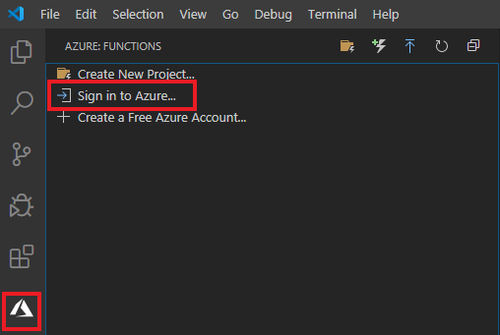
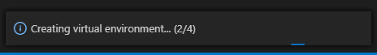

# Demos

## Suggested Presentation Setup

You should have a few things open and ready:
- PowerPoint
- Browser Tab - GitHub - on the demo page: [link to repo](link)
- Browser Tab - COVID-19 API - [https://covid19api.com/](https://covid19api.com/)
- Browser Tab - Twilio Console - [https://www.twilio.com/console](https://www.twilio.com/console)
- Browser Tab - Time Zone Converter - [https://www.timeanddate.com/worldclock/converter.html](https://www.timeanddate.com/worldclock/converter.html)
- Visual Studio Code
    - Extensions: [Azure Functions Core Tools](https://marketplace.visualstudio.com/items?itemName=ms-azuretools.vscode-azurefunctions), [Python](https://marketplace.visualstudio.com/items?itemName=ms-python.python)

## Demo 1 - Create a New Project using Azure Functions Core Tools

**Create project folder**

Since we'll be creating an Azure Function using the [Azure Functions Extension](https://marketplace.visualstudio.com/items?itemName=ms-azuretools.vscode-azurefunctions) in Visual Studio Code, I'd suggest first creating a folder for the entire project. Azure will create some files that are necessary to get the function to work so it's better to get things organized now rather than have to move files around later.

**Open project folder in Visual Studio Code**

Now, let’s open the folder location in Visual Studio Code. In the Visual Studio Code menu, click “File” > “Open Folder...”.


In the file explorer, select the folder you just created and click “Select Folder”.

**Sign in to Azure in Visual Studio Code**

In Visual Studio Code, click the Azure logo then click “Sign in to Azure”.



A window in your browser will open and request you to sign in to Azure. Enter the credentials for your Azure account. After you’ve signed in successfully, the webpage will prompt you to close the window.

In Visual Studio Code, verify that the email address of your Azure account appears in the **Status Bar**. The **Status Bar** is located at the bottom of Visual Studio Code.


**Create a new project**

Now that you’ve verified that you’re signed in to your Azure account, create a new project in Visual Studio Code. In the Azure menu, click “Create New Project”.


In the Visual Studio Code command palette, select the folder that you created earlier at the start of this tutorial. This folder is where the Azure Function files will be created. If the folder is not listed, click “Browse” to open the file explorer.

Visual Studio Code will guide you through the instructions for creating a new function, however, I'll walk you through the steps as well!

First, select “Python” as the language.


Next, select the Python alias to create a virtual environment. As a reminder, only Python 3.6x 64 bit and 3.7x 64 bit are supported.


Next, select “Timer trigger” as the template.


You will then be asked to provide a name for your function. Replace “TimerTrigger” with your function’s name.


Keep the Cron expression as-is - we'll update that later!


Azure will begin to create the function - you can check the progress in the status bar at the bottom of Visual Studio Code.



Once Azure is done, the `__init__.py` file will open. The `__init__.py` file contains a template for a TimerTrigger. Delete the code inside the `main` function. The message for the SMS will be later added to the function.

**Activate virtual environment**

A virtual environment is created alongside the project. Activate the virtual environment by entering the command `.venv\Scripts\activate` (for Windows) or `source .venv/bin/activate` (for Mac and Linux) into the terminal.

**Install Azure Functions Core Tools**

[Azure Functions Core Tools](https://marketplace.visualstudio.com/items?itemName=ms-azuretools.vscode-azurefunctions) lets you develop and test your functions on your local computer from the command prompt or terminal. Your local functions can connect to live Azure services, and you can debug your functions on your local computer using the full Functions runtime. This tool will also enable you to deploy a function app to your Azure subscription. Since we’ll need this to create the function, install Azure Functions Core Tools based on the instructions for your operating system.

## Demo 2 - Setup COVID-19 API GET Request

**Install and import requests**

Since we're working with GET requests, you'll need to import the `requests` module so that we can get data from the COVID-19 API.

Install the module using `pip install requests`. At the top of the `__init__.py` file import the module.

```python
import requests
```


**Setup GET request**

Let's get some data from the [COVID-19 API](https://covid19api.com/)! There are various endpoints to choose from, however, we'll be using **Summary** for our SMS message. We'll need to use the values for **TotalConfirmed** and **TotalDeaths** from the JSON response for the United States.

Inside the `main` function, create the GET request.

```python
def main(mytimer: func.TimerRequest) -> None:
    response = requests.get('https://api.covid19api.com/summary')
    response_json = response.json()

    total_confirmed = response_json['Countries'][-12]['TotalConfirmed']
    total_deaths = response_json['Countries'][-12]['TotalDeaths']
```

We first create a `response` variable that stores the GET request for the API. Be sure to get the JSON response as well! You can store that in the variable `response_json`.

Create variables for `total_confirmed` and `total_deaths` and assign the respective values from the JSON response to each variable.

## Demo 3 - Create Twilio Message

**Create environment variables**

For the demo, environment variables are created inside a `.env` file that's stored at the root of the project folder. Inside the `.env` file, add your environment variables for your Twilio `TWILIO_ACCOUNT_SID`, `TWILIO_AUTH_TOKEN`, `MY_TWILIO_NUMBER` and `RECEIVER_NUMBER`. Be sure to save the file.

```env
TWILIO_ACCOUNT_SID=YOUR_TWILIO_ACCOUNT_SID
TWILIO_AUTH_TOKEN=YOUR_TWILIO_AUTH_TOKEN
MY_TWILIO_NUMBER='+XXXXXXXXXX'
RECEIVER_NUMBER='+XXXXXXXXXX'
```

You can find the **Twilio Account SID** and **Auth Token** for your account in your [Twilio Console](https://twilio.com/console?_ga=2.50357740.498092277.1587660290-75944301.1578957291). For the Twilio numbers, be sure to start the number with the country code using [E.164 standard](https://www.twilio.com/docs/glossary/what-e164). Also, if you are using a free Twilio account make sure that the `RECEIVER_NUMBER` phone number is a verified phone number within the Twilio console.

Now that your environment variables are created, switch back over to the `__init.py__` file.

To access the environment variables, you’ll need to install `python-dotenv`. You can install the module using `pip install python-dotenv`.

In `__init.py__`, import the following at the top of the file:

```python
from dotenv import load_dotenv
load_dotenv()

import os
```

Next, use `os` to access the environment variables. 

```python
account_sid = os.getenv("TWILIO_ACCOUNT_SID")
auth_token = os.getenv("TWILIO_AUTH_TOKEN")
my_twilio_number = os.getenv("MY_TWILIO_NUMBER")
receiver_number = os.getenv("RECEIVER_NUMBER")
```

**Install and import Twilio**

The [Twilio Python Helper Library](https://www.twilio.com/docs/libraries/python) makes it easy to interact with the Twilio API from the Python app.
You can install the Twilio Python Helper Library using `pip install twilio` in the terminal within Visual Studio Code.

Import `twilio` above the variables for the environment variables.

```python
from twilio.rest import Client
```

**Create message**

Now it's time for some Twilio fun! Twilio provides a template that you can use - which is a huge time saver. The template can be found in the [Twilio Programmable SMS](https://www.twilio.com/docs/sms/tutorials/how-to-send-sms-messages-python) documentation. You'll need to copy everything from `client = Client(account_sid, auth_token)` to `print(message.sid)`. Replace the `from` and `to` values with the variables created earlier which stores the environment variables for the Twilio phone number and receiver's phone number.

Let's walk through the template:

```python

client = Client(account_sid, auth_token)
    
    message = client.messages \
        .create(
            body=f'As of today, there are {total_confirmed} cases and {total_deaths} deaths for the United States.',
            from_=my_twilio_number,
            to=receiver_number
            )
            
    print(message.sid)
```

The `client` variable class looks for your Twilio credentials by default in TWILIO_ACCOUNT_SID and TWILIO_AUTH_TOKEN environment variables.

Next, we'll create the message. Using the variables we created earlier for data from the COVID-19 API, use f-strings to create a message. In the code above, I created the message: `As of today, there are {total_confirmed} confirmed cases and {total_deaths} deaths for the United States.`

## Demo 4 - Visual Studio Code Debugger

Now that the message is created, we can prepare for testing the function. However, we need to update the `requirements.txt` file and `function.json` file. 

**requirements.txt**

Open the `requirements.txt` file. We'll need to add the modules that we imported into the code. Add the modules and save the file.

```txt
azure-functions
requests
twilio
python-dotenv
```

**function.json** 

Right now, the code defaults to generating a text every 5 minutes. However, if that's too long of a wait, you can adjust the [CRON expression](https://docs.microsoft.com/en-us/azure/azure-functions/functions-bindings-timer?tabs=csharp#ncrontab-expressions) in the `function.json` file. You can locate the `function.json` file inside the folder created for your function. I would suggest changing the 5 to a 1 if you want the trigger to send the text every minute while you debug in the next step.

```json
{
  "scriptFile": "__init__.py",
  "bindings": [
    {
      "name": "mytimer",
      "type": "timerTrigger",
      "direction": "in",
      "schedule": "0 */1 * * * *"
    }
  ]
}
```

If you choose to update the CRON expression, be sure to save the file and return to `__init__.py`.

**Run in the debugger**

You can test everything by running the debugger. Your code in 
`__init__.py` should reflect the following:

```python
from dotenv import load_dotenv
load_dotenv()

import os

import datetime
import logging

import azure.functions as func

import requests

from twilio.rest import Client

account_sid = os.getenv("TWILIO_ACCOUNT_SID")
auth_token = os.getenv("TWILIO_AUTH_TOKEN")
my_twilio_number = os.getenv("MY_TWILIO_NUMBER")
receiver_number = os.getenv("RECEIVER_NUMBER")


def main(mytimer: func.TimerRequest) -> None:
    response = requests.get('https://api.covid19api.com/summary')
    response_json = response.json()

    total_confirmed = response_json['Countries'][-12]['TotalConfirmed']
    total_deaths = response_json['Countries'][-12]['TotalDeaths']
    
    client = Client(account_sid, auth_token)
    
    message = client.messages \
        .create(
            body=f'As of today, there are {total_confirmed} cases and {total_deaths} deaths for the United States.',
            from_=my_twilio_number,
            to=receiver_number
            )
            
    print(message.sid)
```

Make sure that you’re looking at the `__init__.py` file.  In the Visual Studio Code menu, click “Run” > “Start Debugging”.


Visual Studio Code will first prompt you to select a “Storage Account”. Click “Select storage account”.


Next, either select an existing Storage Account or click “+ Create new storage account”. If you are using an existing storage account, proceed to the section **Wait for a message**.

If you are creating a new storage account, provide a name for the storage account. Next, either select an existing “Resource Group” or click “+ Create new resource group”. Provide a name for the new resource group if you’re creating a new resource group. After you create or select an existing resource group, select a location for the resources. Additional information regarding locations is available at [Azure Locations](https://azure.microsoft.com/en-us/global-infrastructure/locations/).

After the resource location is selected, Visual Studio Code will create the storage account. You can check the status at the bottom right of the Visual Studio Code window.

Once the storage account is created, you're ready to test the function!

**Wait for a message**

If the process fails the first time you debug, press “Ctrl” + “C” on your keyboard to shut down the debugger. Once everything is shut down, head to the terminal and enter the command `func host start`. This command is an alternative way to start the debugger. If you’re still receiving errors, review the the code to ensure that everything is accurate and that all the files reflect the updates that were made throughout this tutorial.


Depending on the CRON expression you chose, the text will be sent after the first event triggers.

## Demo 5 - Deploy Function to Azure

**Update CRON expression for a daily trigger**

Before you deploy to Azure, adjust the CRON expression in the `function.json` file. By default, the Azure function uses the UTC timezone. To set the timer to trigger at 9AM in your specific time zone, set a time in that timezone that equates to 9AM UTC. Since I'm in California, I follow Pacific Time. Therefore, my CRON expression for everyday at 9AM would be: `0 0 16 * * *`.

You can use the [time and data time zone converter](https://www.timeanddate.com/worldclock/converter.html) to figure out the equivalent to 9AM UTC in your time zone.

Update the CRON expression and save the function.json file.

**Deploy to Azure**

You can now deploy the function to Azure! It’s worth noting that you will not be able to edit the files directly in the Azure Portal. Therefore, if you need to make any changes to the function files, you’ll have to deploy again.

Confirm the changes to the `requirements.txt`, `function.json` and `__init__.py` files.

After you’ve confirmed and saved all files, click on the “Azure” tab in Visual Studio Code. Select the project and click the “Deploy” icon.


You will be prompted to **+ Create new Function App in Azure…** Make sure not to select the option labeled with **Advanced**.


You will then be prompted to provide a globally unique name for the app - essentially, no other function that exists on Azure should have this name.


Next, select the version of Python that you selected earlier when you first created the Azure Function. As a reminder, only Python 3.6.x and Python 3.7.x are supported.


You will now need to select a location for the new resources. Select a location based on where the function will be used. Additional information regarding locations is available at [Azure Locations](https://azure.microsoft.com/en-us/global-infrastructure/locations/).


Azure will begin the process to deploy the function. You can follow the progress in the status bar at the bottom right of the screen as well as the **Output** console. It takes a few minutes for your first deployment to complete, however, your subsequent deployments for the function will happen faster.

After the deployment is complete, the function can be viewed in the Azure portal. As a reminder, if you ever need to make adjustments to the files, you can do so locally in Visual Studio Code and deploy the app again. When prompted, overwrite the previous deployment.

Once you're done with everything, you can type `deactivate` in the terminal to quit the virtual environment for the project.

If you're not going to continue to use the function, you can clean up the resources in the Azure portal - otherwise, the app will continue to run and you'll incur a minimal cost.

In the Azure portal, select “Resource groups” from the left-side navigation pane. Next, click the resource group that was created in the process of this tutorial. Finally, click “Delete resource group” in the top menu. The Azure Portal will ask you to confirm that you want to delete the resource. Follow the instructions to confirm and click “Delete”.
